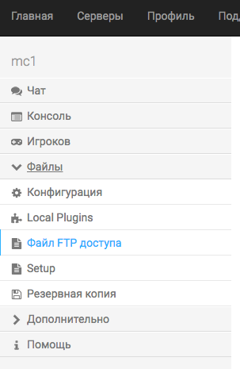
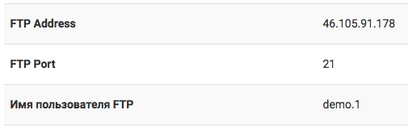
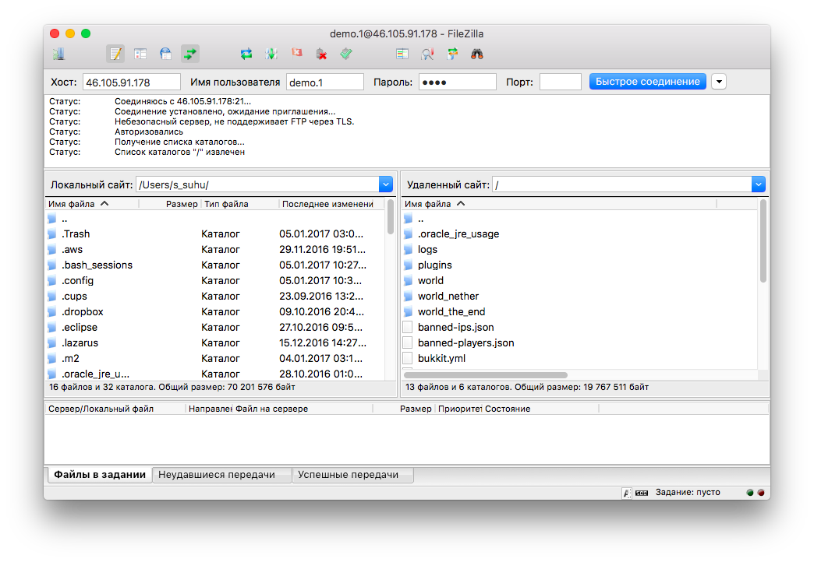

Подключение к серверу по FTP (файлы сервера)
=======================

Чтобы получить доступ к сборке сервера, нужно подключиться к серверу по FTP. Мы рекомендуем программу `FileZilla <http://filezilla.ru/get/>`_, она простая и функциональная, то что нужно.

Данные FTP доступа находятся в панели управления:

Откройте пункт "Серверы", слева выберите "Файлы", затем "Файл FTP доступа"

       
Это данные для доступа:

       
FTP Adress - Хост
FTP Port - Порт
Имя пользователя FTP - Имя пользователя
Пароль такой же, как от панели управления

Пример:

       

Остались вопросы? Пиши в `Биллинг <https://bill.1hosting.pro>`_ (Поддержка > Запрос > Создать) или в `Сообщения ВК <https://vk.me/minehostingpro>`_
